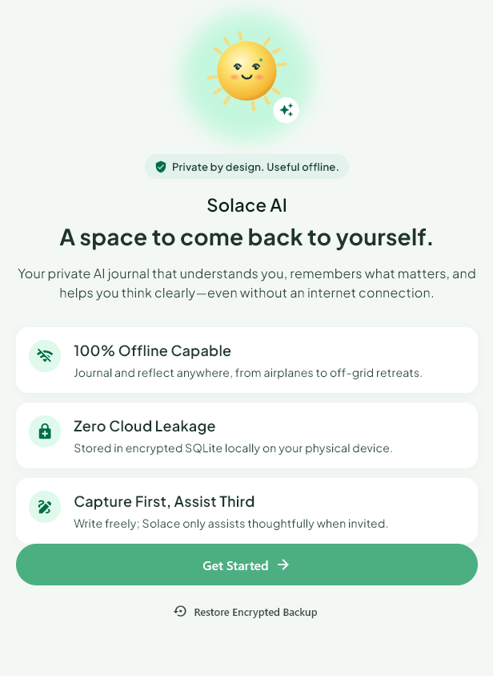
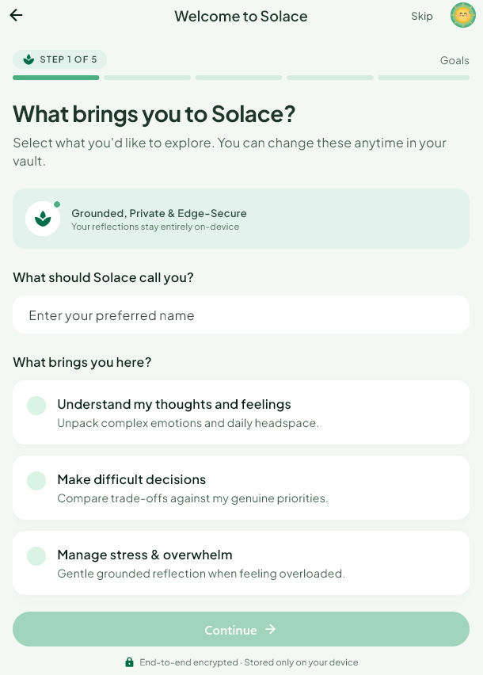
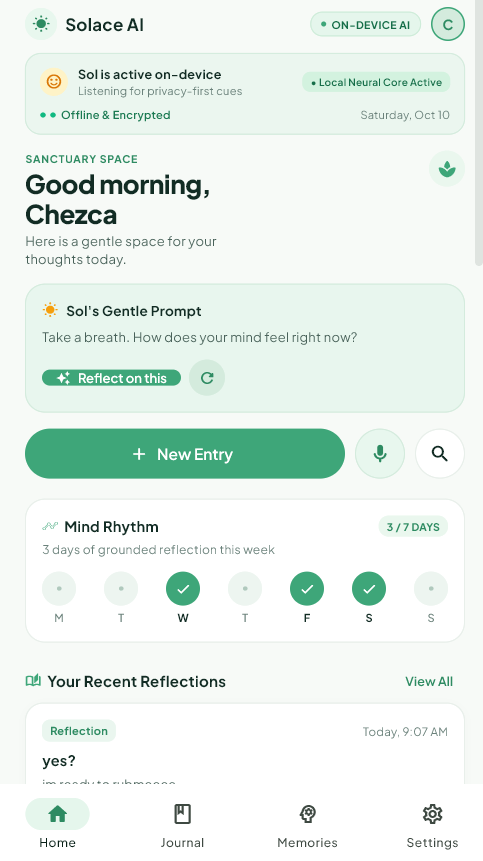
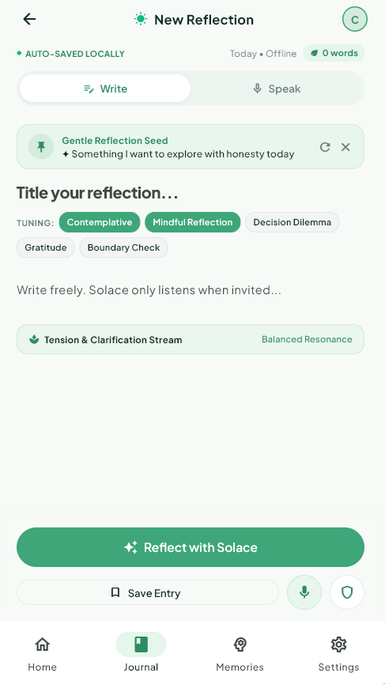
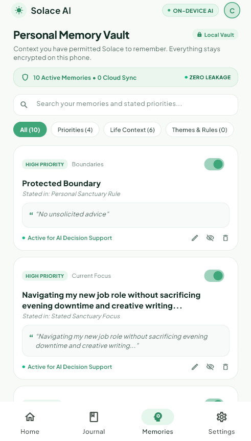

<p align="center">
  
</p>

<div align="center">
  <h1>Solace.ai</h1>
  <p><strong>A private space to reflect, remember what matters, and think clearly.</strong></p>
</div>

<p align="center">
  
  <a href="https://opensource.org/licenses/MIT"></a>
</p>

**Tagline:** Private by design. Personal by learning. Useful offline.

**Project description:** Solace.ai is a journal-first reflection companion. People can write freely, choose when they want help, and decide which preferences or memories Solace may use. The product is designed around local-first privacy, contextual decision support, and graceful offline use—not an always-on chatbot.

[Product Blueprint](docs/PRODUCT.md) · [Architecture](docs/ARCHITECTURE.md) · [AI & Offline Behavior](docs/AI.md) · [MIT License](LICENSE)

## 📌 Product Overview

### What users can do

- **Write privately:** Create, edit, find, and delete journal entries stored locally.
- **Ask for support when wanted:** Request a reflection or compare choices using priorities they selected.
- **Control personal context:** Review, edit, exclude, or delete approved memories and preferences.

### Why it matters

Journaling can feel directionless, personal context is easy to lose, and generic cloud AI may not reflect a person's priorities. Solace aims to help people make sense of their own writing while keeping control of sensitive context in their hands.

**Product principle:** Capture first. Understand second. Assist third. AI is optional; writing freely is the primary experience.

### Current project status

Solace is an actively developed Flutter prototype. It includes onboarding, a home dashboard, journal writing and reflection flows, and a personal memory vault. The deployed web demo is available below. Some capabilities vary by platform: the web build uses in-memory journal state, while SQLite persistence is used on supported native platforms. On-device model availability and behavior depend on the device and runtime; Solace also has a rule-based fallback. See [docs/AI.md](docs/AI.md) and [docs/DEVICE_TESTING_GUIDE.md](docs/DEVICE_TESTING_GUIDE.md) for current limitations and verification guidance.

---

## 🚀 Live Demo

[Open Solace AI](https://solace-ai-delta.vercel.app/)

The web demo is useful for exploring the interface. Browser storage and native device features differ from the mobile app; do not use the demo for sensitive journal content.

---

## 📸 Screenshots

| Landing page | Onboarding |
| --- | --- |
|  |  |

| Home | Journal |
| --- | --- |
|  |  |



## 🛠️ Tech Stack

| #   | Tool / Technology                          | Category               | Description                                                                     |
| --- | ------------------------------------------ | ---------------------- | ------------------------------------------------------------------------------- |
| 1   | Flutter / Dart                             | Cross-platform app     | Shared UI for mobile, web, and desktop targets.                                  |
| 2   | SQLite / `sqflite`                         | Native persistence     | Journal entries, preferences, and memories on supported native platforms.       |
| 3   | `flutter_gemma`, `flutter_gemma_mediapipe` | On-device AI           | Optional local model integration with a rule-based fallback.                    |
| 4   | `speech_to_text`, `record`, `audioplayers` | Voice features         | Dependencies used by voice journaling flows.                                    |
| 5   | Plus Jakarta Sans                         | Typography             | Bundled font used by the app theme.                                              |

---

## 🏗️ System Architecture

Native builds store journal data in SQLite on the device. The web build currently keeps journal state in memory, so data does not persist across reloads. The AI service attempts to use the local Gemma runtime when available and falls back to rule-based responses. Verify model behavior and offline operation on each target device.

```text
[Flutter UI] ---> [Local App Workflows] ---> [SQLite on device]
                         |
                         +---> [Permission-aware local retrieval]
                         |
                         +---> [Verified on-device model OR disclosed rule-based fallback]
```

See [docs/ARCHITECTURE.md](docs/ARCHITECTURE.md) for component responsibilities and data flows.

---

## 🔒 Security & Data Privacy

Privacy behavior depends on the platform and current implementation. Native storage is local SQLite; web journal state is in memory and is cleared on reload. Local storage alone does not guarantee encryption or protection from device compromise.

- **Local-first:** Journal content should stay on the device by default; do not send it to cloud AI or analytics.
- **User control:** Use only context the user permits, and ask before saving inferred themes as long-term memories.
- **No sensitive logs:** Never log raw journal text or prompts containing private content.
- **Honest AI status:** Distinguish model output from deterministic fallback behavior.
- **Safe boundaries:** Solace is a journaling and reflection companion, not a clinician, diagnostic product, or crisis service.
- **Storage security:** Offline storage alone is not a complete security guarantee. Assess database protection, backups, device compromise, and deletion behavior before production.

---

## ⚙️ Getting Started & Local Setup

### Prerequisites

- Flutter SDK 3.10 or newer and Dart
- Git
- For Android: Android Studio and Android SDK, plus an emulator or USB-debugging-enabled Android device

### Installation

1. Clone the repository:

```powershell
git clone https://github.com/chezca-v/solace.ai.git
cd solace.ai
```

2. Check your Flutter setup and install Dart dependencies:

```powershell
flutter doctor
flutter pub get
```

3. Start an Android emulator or connect a device, then run:

```powershell
flutter devices
flutter run
```

4. To build an Android APK:

```powershell
flutter build apk
```

If more than one device is available, specify one with `flutter run -d <device-id>`. For a browser build, run `flutter run -d chrome` with Chrome installed.

No `.env` file or backend service is required to run the current app.

---

## 🧪 Testing

Run the Flutter analyzer and tests:

```powershell
flutter analyze
flutter test
```

On-device inference and offline behavior must additionally be verified on the actual target phone; see [docs/AI.md](docs/AI.md).

---

## 🗂️ Repository Structure

```text
solace.ai/
├── android/              # Android application
├── assets/               # Shared bundled fonts, brand art, images, and animations
├── docs/                 # Product, architecture, and AI documentation
├── ios/                  # iOS application
├── lib/
│   ├── ai/               # AI orchestration, prompts, and local engines
│   ├── services/         # Shared services
│   ├── ui/screens/        # Flutter screens
│   └── main.dart          # Current app entry point
├── test/                 # Flutter tests
├── pubspec.yaml           # Flutter dependencies and project settings
└── README.md              # Project overview and setup
```

---

## 🤝 Contributing

Contributions are welcome. Please focus on the local-first product principles and clearly distinguish planned behavior from verified functionality.

1. Fork the project.
2. Create a feature branch.
3. Make and test your changes with `flutter analyze` and `flutter test`.
4. Open a pull request describing the change and its validation.

---

## 📄 License

Distributed under the MIT License. See [LICENSE](LICENSE) for details.

## 🤔‍💻 Meet the Team

<table align="center" border="0" cellpadding="0" cellspacing="0" width="100%">
  <tr>
    <td align="center" width="25%">
      <br>
      <strong>Franchezca Natividad Z. Banayad</strong><br>
      <sub>Product Lead</sub><br><br>
      <a href="https://www.linkedin.com/in/franchezca-banayad/">
        
      </a>
    </td>
    <td align="center" width="25%">
      <br>
      <strong> John Benedict S. Listangco</strong><br>
      <sub>DevOps & Infrastructure Lead</sub><br><br>
      <a href="https://www.linkedin.com/in/john-benedict-listangco/">
        
      </a>
    </td>
    <td align="center" width="25%">
      <br>
      <strong>Princess Mae V. Sanchez</strong><br>
      <sub>AI Engineer</sub><br><br>
      <a href="https://www.linkedin.com/in/cessamaeeee/">
        
      </a>
    </td>
        <td align="center" width="25%">
      <br>
      <strong>Niña Ysabelle C. Frigillana</strong><br>
      <sub>Frontend Develope</sub><br><br>
      <a href="https://www.linkedin.com/in/frigillanaysabelle/">
        
      </a>
    </td>
  </tr>
</table>
