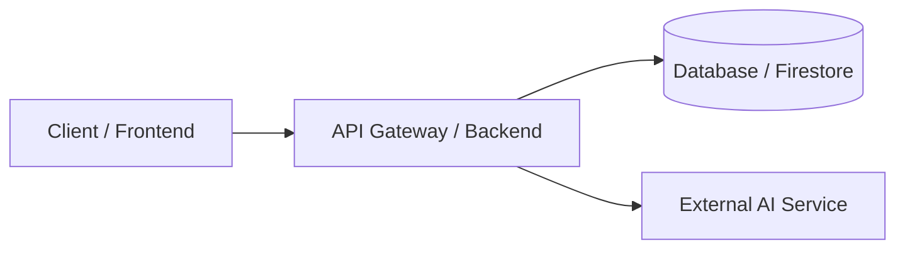

<div align="center">
  
</div>
<h1 align="center">Project Name: Catchy Tagline or Subtitle</h1>

<p align="center">
  <a href="https://img.shields.io/badge/Status-In%20Development-blueviolet"></a>
  <a href="https://opensource.org/licenses/MIT"></a>
</p>

**Tagline:** Clear, concise statement of what problem this project solves.

**Project description:** Provide a compelling 1-2 paragraph overview of your project. Explain what it is, who it is built for, and the core value proposition that sets it apart from existing solutions. Mention key architectural or technical highlights briefly.

[Live Demo](#live-app) · [Architecture](docs/architecture.md) · [Security & Privacy](SECURITY.md) · [MIT License](LICENSE)

## 📌 Product Overview

### What users can do
- **Core Feature 1:** Brief description of what the user can accomplish.
- **Core Feature 2:** Brief description of an interactive or utility workflow.
- **Core Feature 3:** Data export, sharing, or customization options.

### Why it matters
Explain the core motivation behind the project, your target audience, and any real-world impact or business logic context.

---

## 🚀 Live App

[https://your-live-app-url.com/](https://your-live-app-url.com/)

Describe any special configuration notes for the live environment (e.g., fallback behaviors, API keys, or test credentials).

---

## 📸 Screenshots

*(Optional: Describe where your detailed screenshot folders are located or showcase a walkthrough GIF below)*


### Portal / View A Screenshots

<table width="100%">
  <tr>
    <td align="center" valign="top">
      <strong>Dashboard View</strong><br><br>
      
    </td>
    <td align="center" valign="top">
      <strong>Calendar View</strong><br><br>
      
    </td>
  </tr>
</table>

---

## 🛠️ Tech Stack

| # | Tool / Technology | Category | Description |
|---|---|---|---|
| 1 |  | Core Language | Enhances JavaScript with static types. |
| 2 |  | Frontend | Library for building user interfaces. |
| 3 |  | Frontend | Utility-first CSS framework. |
| 4 |  | Backend | JavaScript runtime environment. |
| 5 |  | Database & Auth | Authentication and Firestore database. |
| 6 |  | Tooling | Frontend build tool. |

---

## 🏗️ System Architecture

Provide a high-level description or diagram mapping how your system components interact.



---

## 🔒 Security & Data Privacy

* **Data Encryption:** Encrypted in transit (HTTPS/TLS) and at rest.
* **Access Control:** Enforced via strict database rules and token authentication.
* **Environment Safety:** Secrets handled securely; `.env` files are excluded via `.gitignore`.

---

## ⚙️ Getting Started & Local Setup

### Prerequisites

* Node.js (v18 or newer)
* npm or yarn

### Installation

1. Clone the repository:
```
git clone https://github.com/your-username/your-repo-name.git
cd your-repo-name
```


2. Install dependencies:
```
npm install
```


3. Configure environment variables:
```
cp .env.example .env
# Populate your API keys and configuration settings
```


4. Start the development server:
```
npm run dev
```


Open [http://localhost:3000](http://localhost:3000) to view it in your browser.

---

## 🧪 Testing

Run automated checks and test suites locally:

```
npm run typecheck
npm test
npm run build
```

---

## 🗂️️ Repository Structure

```sh
your-project-name/
├── public/              # Static assets and public HTML pages
├── src/
│   ├── assets/          # Images, logos, and icons
│   ├── config/          # Configurations (e.g., database, clients)
│   ├── components/      # Reusable UI components
│   ├── services/        # Core application services & API callers
│   └── utils/           # Shared helper functions
├── api/                 # Server-side logic or serverless functions
├── docs/                # Project documentation and architecture notes
├── .env.example         # Environment variable template
├── package.json         # Dependencies and build scripts
└── README.md            # Project documentation

```

---

## 🤝 Contributing

Contributions are welcome! Please feel free to open an issue or submit a pull request.

1. Fork the Project
2. Create your Feature Branch (`git checkout -b feature/AmazingFeature`)
3. Commit your Changes (`git commit -m 'Add some AmazingFeature'`)
4. Push to the Branch (`git push origin feature/AmazingFeature`)
5. Open a Pull Request

---

## 📄 License

Distributed under the MIT License. See [LICENSE](https://www.google.com/search?q=LICENSE) for more information.

---

## 🤔‍💻 Meet the Team

<table align="center" border="0" cellpadding="0" cellspacing="0" width="100%">
  <tr>
    <td align="center" width="33.33%">
      <br>
      <strong>Member Name 1</strong><br>
      <sub>Role / Lead Developer</sub><br><br>
      <a href="https://www.linkedin.com/in/your-linkedin-profile/">
        
      </a>
    </td>
    <td align="center" width="33.33%">
      <br>
      <strong>Member Name 2</strong><br>
      <sub>Role / UI & UX Designer</sub><br><br>
      <a href="https://www.linkedin.com/in/your-linkedin-profile/">
        
      </a>
    </td>
    <td align="center" width="33.33%">
      <br>
      <strong>Member Name 3</strong><br>
      <sub>Role / Backend Engineer</sub><br><br>
      <a href="https://www.linkedin.com/in/your-linkedin-profile/">
        
      </a>
    </td>
  </tr>
</table>
